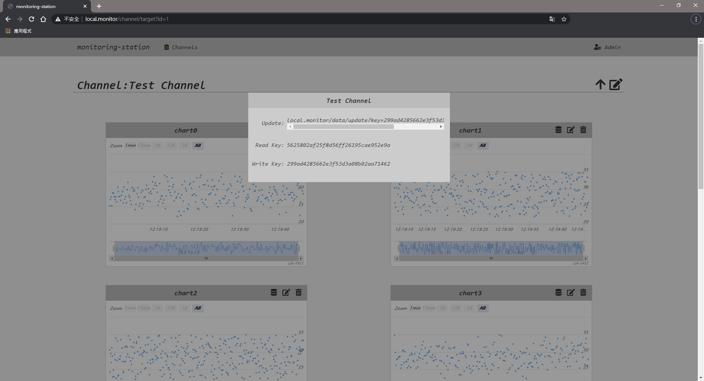

## 資料收集站

**fastphp** Fork from https://github.com/yeszao/fastphp.git

要求：

* Apache2.2 or Apache2.4  
* PHP 5.4.0+  
* Arduino UNO *1  
* ESP8266-S01 *1  

## 使用

### 1.安装

git clone git@github.com:fizz0113/fastphp-monitoring-station.git

### 2.設置資料庫

將`test.sql`匯入資料庫內  


### 3.修改設置文件

打開配置文件 config/config.php  
1.更改 `your-userid` `your-password` 將資料庫帳密輸入至此  

```php5 php7
$config['db']['host'] = 'localhost';
$config['db']['username'] = 'your-userid';
$config['db']['password'] = 'your-password';
$config['db']['dbname'] = 'test';
```

### 4.設置Apache

修改apache/conf/httpd.conf  
1.更改 `your-IP : your-PORT` 將電腦IP及PORT輸入至此  
2.指向index所在 `資料夾位置(this-project)`  

```apache
Listen your-IP : your-PORT
<Directory "${DocumentRoot}/this-project">
    Options
    AllowOverride All
    Require all granted
</Directory>
```


### 5.開啟瀏覽器

將 `your-IP` `your-PORT`  改為剛剛輸入的電腦IP及PORT  
訪問：http://your-IP:your-PORT/  

```
帳號 : Admin / Test
密碼 : 123456
```

### 6.測試

進到Channel之後，能夠利用`Arduino UNO` + `ESP8266-S01`上傳  

修改`test_iot.ino` 並燒錄至Arduino  

```arduino
#include <SoftwareSerial.h>

// 與ESP8266-S01 連接腳位 如果有連接不一樣要修改
#define _rxpin      4
#define _txpin      5

// 與WIFI連接的SSID和密碼 如果有連接不一樣要修改
#define Ssid  "\"your-wifi-ssid\""
#define Pasw  "\"your-wifi-password\""

String ConnectWifi;

// 將IP改為剛剛輸入的電腦IP及PORT
String IP = "\"your-IP\",your-PORT";

// 將your-writekey改為網頁上看到的writekey
String GET = "GET /data/update?key=your-writekey";
```

  **查看Arduino監控頁面的上傳狀態**  
  **查看網頁上的更新狀態**  

### 7.展示



